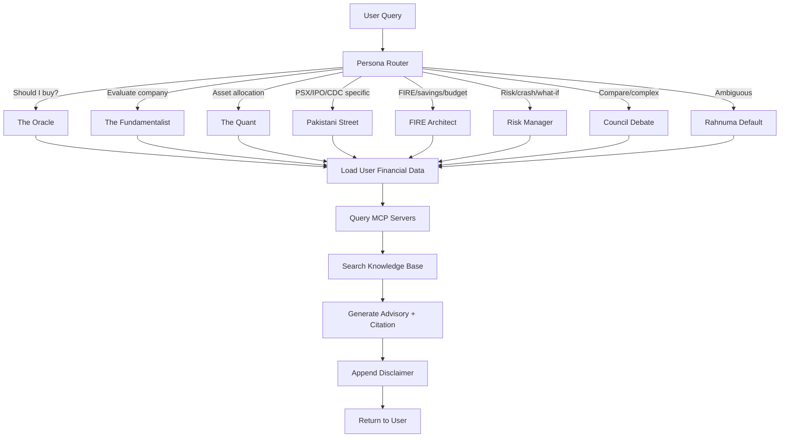

# RAHNUMA AI — AGENTS.md

> **Purpose:** Defines all AI agents, their roles, routing logic, and interaction protocols
> **Status:** Architecture Phase — not implemented

---

## 1. AGENT ROSTER

### 1.1 Primary Agent: Rahnuma (The Advisor)

```yaml
name: rahnuma_advisor
type: conversational
model: claude-sonnet (default) | claude-opus (complex scenarios)
state: stateful (LangGraph — maintains conversation + user financial context)
tools:
  - portfolio_reader
  - budget_reader
  - fire_calculator
  - cgt_calculator
  - scenario_simulator
  - psx_market_data_mcp
  - mutual_fund_nav_mcp
  - rag_retriever
persona: dynamic (routes to Advisory Council based on query type)
```

**Behavior:**
1. Receives user query
2. Classifies query type (portfolio, budget, FIRE, tax, education, scenario)
3. Selects appropriate persona(s) from Advisory Council
4. Loads relevant user data (portfolio, budget, goals) from state
5. Queries MCP servers for real-time market data if needed
6. Generates advisory response with citations
7. Appends disclaimer
8. Updates conversation state

### 1.2 Sub-Agent: Persona Router

```yaml
name: persona_router
type: classifier
model: phi3:mini (local — fast, cheap, private)
input: user_query + conversation_context
output: persona_id | "council_debate" | "rahnuma_default"
```

**Routing Rules (Deterministic First):**

| Query Pattern | Persona | Confidence |
|---|---|---|
| Contains "should I buy/sell" | The Oracle | High |
| Contains "evaluate/analyze company" | The Fundamentalist | High |
| Contains "allocate/diversify/rebalance" | The Quant | High |
| Contains "IPO/CDC/DHA/CGT/PSX specific" | The Pakistani Street | High |
| Contains "FIRE/retire/savings rate/expenses" | The FIRE Architect | High |
| Contains "risk/crash/what if disaster" | The Risk Manager | High |
| Contains "compare perspectives" or complex | Council Debate | High |
| Ambiguous / general | Rahnuma Default | Fallback |

### 1.3 Sub-Agent: Scenario Engine

```yaml
name: scenario_engine
type: computational
model: deterministic (no LLM — pure math)
input: scenario_parameters + user_financial_data
output: projection_data (JSON for charts)
```

**Capabilities:**
- SIP amount change → 10/20/30 year projections
- Inflation rate change → purchasing power impact
- Currency devaluation → portfolio impact by sector
- Job loss → runway calculation from emergency fund
- Property purchase → cash flow + opportunity cost analysis
- Interest rate change → bond/savings certificate impact

### 1.4 Sub-Agent: Briefing Generator

```yaml
name: briefing_generator
type: scheduled (n8n trigger — daily 7:00 AM PKT)
model: claude-sonnet (summary generation)
input: user_portfolio + overnight_market_data + news
output: structured_briefing (push notification + full report)
```

### 1.5 Sub-Agent: Document Scanner

```yaml
name: document_scanner
type: multimodal
model: gemini-3-pro (best multimodal for receipts/statements)
input: image (receipt, bank statement, tax document)
output: structured_data (expense entry, transaction record)
```

---

## 2. AGENT INTERACTION FLOW



---

## 3. TOOL DEFINITIONS

| Tool | Type | Auth Required | Offline? |
|---|---|---|---|
| `portfolio_reader` | Database query | Yes (user session) | Yes (cached) |
| `budget_reader` | Database query | Yes | Yes (cached) |
| `fire_calculator` | Deterministic math | No | Yes |
| `cgt_calculator` | Deterministic math | No | Yes |
| `scenario_simulator` | Deterministic math | No | Yes |
| `psx_market_data_mcp` | MCP server call | API key | No |
| `mutual_fund_nav_mcp` | MCP server call | None (public data) | No |
| `sbp_rates_mcp` | MCP server call | None (public data) | No |
| `news_aggregator_mcp` | MCP server call | API key | No |
| `rag_retriever` | Vector search | No | Partial (cached) |

---

## 4. CONVERSATION STATE SCHEMA

```json
{
  "session_id": "uuid",
  "user_id": "uuid",
  "active_persona": "oracle | fundamentalist | quant | psx_vet | fire | risk_mgr | council | default",
  "conversation_history": [],
  "financial_context_loaded": {
    "portfolio_snapshot": {},
    "budget_summary": {},
    "fire_plan": {},
    "net_worth": 0
  },
  "market_context": {
    "kse100_last": 0,
    "portfolio_day_change": 0,
    "relevant_news": []
  },
  "session_start": "ISO8601",
  "queries_this_session": 0
}
```


## Principle XV: Delivery-First
Phone (primary) + laptop browser (secondary). Home WiFi or mobile
data available. Internet REQUIRED for live PSX prices and forex
rates — user expects this. Portfolio viewing + historical charts
MUST work offline. Locking user out of their own holdings data
because a server is down is a Principle XV violation.
Data: manual entry + PSX API + SBP rates. No camera. No OCR.
Output: screen (charts) + optional WhatsApp share + PDF for tax.

## Principle XVI: Model Selection
Runtime: DeepSeek V4 Flash via OpenRouter (primary — analysis, Q&A).
Fallback: Kimi K2.6 / GLM 5.1 if DeepSeek quota exhausted.
Offline: Gemma 4 E4B for basic portfolio Q&A without internet.
Every response prefixed: "Information only, not investment advice."
LLM never says "buy" or "sell."


https://github.com/TauricResearch/TradingAgents

https://arxiv.org/abs/2412.20138

---

*Agents are defined. Routing is specified. Implementation begins when Phase 1 starts.*
